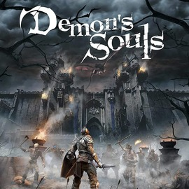

# Demon's Souls
### Hecho por Bluepoint Games / PlayStation Studios
##### Demon's Souls es un videojuego de rol de acción desarrollado por Bluepoint Games, con asistencia de Japan Studio, y publicado por Sony Interactive Entertainment. Es un remake de Demon's Souls, originalmente desarrollado por FromSoftware y publicado para la PlayStation 3 en 2009. 
##### El juego fue publicado como un título de lanzamiento para la PlayStation 5 en noviembre de 2020.

