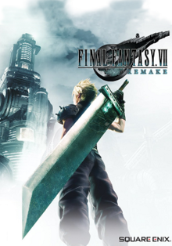

# Final Fantasy VII Remake 
### Hecho por Square Enix
##### Es un videojuego de rol de acción, publicado por la empresa Square Enix para la plataforma PlayStation 4, que fue lanzado el 10 de abril de 2020, es una nueva versión del videojuego Final Fantasy VII del año 1997 para la consola PlayStation. 
##### La historia sigue al mercenario Cloud Strife mientras él y el grupo ecoterrorista AVALANCHE luchan contra la corrupta megacorporación de Shinra y el legendario exsoldado de Shinra Sefirot. 
##### El videojuego combina la acción en tiempo real similar a Dissidia Final Fantasy con otros elementos estratégicos.
##### La nueva versión fue anunciada después de años de rumores y solicitudes de fanáticos. Cuatro miembros clave del personal volvieron a ayudar con la nueva versión: el diseñador de personajes original Tetsuya Nomura regresó como director y diseñador de personajes principales, el director original Yoshinori Kitase actuó como productor, Kazushige Nojima volvió a escribir el guion y el compositor Nobuo Uematsu. 
##### Debido a la escala del proyecto, el equipo decidió lanzar una nueva versión como videojuegos múltiples para que no se reduzca el contenido original. También decidieron agregar contenido nuevo y ajustar los diseños de los personajes originales para equilibrar el realismo y la estilización.

